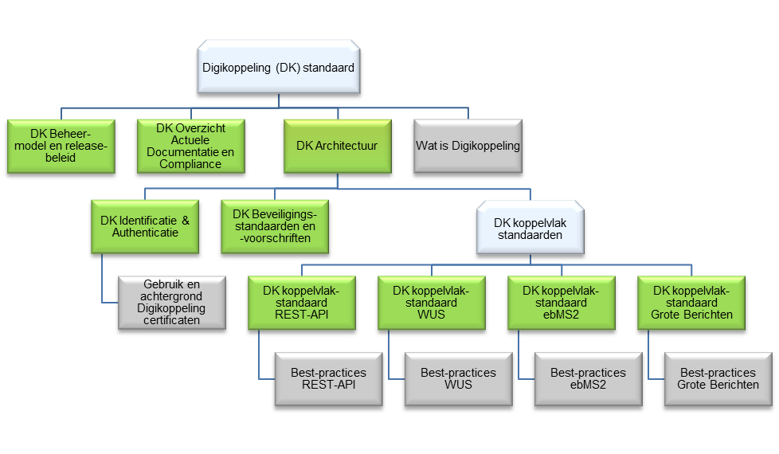

# Inleiding

Dit document beschrijft de uitgangspunten en principes voor identificatie- en
authenticatieafspraken die gehanteerd worden tussen overheidsorganisaties bij
gebruik van Digikoppeling.

Digikoppeling maakt het mogelijk voor overheidsorganisaties om op een
gestandaardiseerde wijze gebruik te maken van elkaars services, conform de NORA
(Nederlandse Overheids Referentie Architectuur).

In de e-overheid gaat het over geautomatiseerde systemen van die organisaties
die services aanbieden en afnemen dus over zogeheten system-to-system verkeer.

Conform de NORA moet eerst duidelijkheid bestaan over de bedrijfs- en
informatiearchitectuur voor dit onderwerp. Daarvan afgeleid komt pas de
technische architectuur. Die architectuuraspecten van identificatie en
authenticatie richten zich op drie verschillende onderwerpen, die in separate
documenten worden beschreven:

- Welke identiteit is gewenst en waarom (bedrijfs- en informatiearchitectuur)
    \- dat wordt in dit document beschreven.

- Wat betekent die benadering van identiteit voor het authenticatiemiddel in
    combinatie met PKIoverheid certificaten (informatie- en technische
    architectuur).

- Hoe wordt authenticatie ondersteund op Digikoppeling, dat wil zeggen: hoe
    wordt met dat middel omgegaan (technische architectuur).

## Doelgroep van dit document

Onderstaande tabel geeft de doelgroep van dit document weer.

| Afkorting | Rol                             | Taak                                                                                                       | Doelgroep? |
|---|---|---|---|
| [MT]      | Management                      | Bevoegdheid om namens organisatie (strategische) besluiten te nemen.                                       | **Nee**    |
| [PL]      | Projectleiding                  | Verzorgen van de aansturing van projecten.                                                                 | **Nee**    |
| [A&D]     | Analyseren & ontwerpen (design) | Analyseren en ontwerpen van oplossings-richtingen. Het verbinden van Business aan de IT.                   | **Ja**     |
| [OT&B]    | Ontwikkelen, testen en beheer   | Ontwikkelt, bouwt en configureert de techniek conform specificaties. Zorgen voor beheer na ingebruikname.  | **Ja**     |

## Leeswijzer

Dit document gaat over de bedrijfsarchitectuur op landelijk niveau, en specifiek
over de identificatie en authenticatie van organisaties. Eerst beschrijven we de
probleemstelling in hoofdstuk 2. De kernbegrippen staan gedefinieerd in
hoofdstuk 3. In hoofdstuk 4 analyseren we het gewenste niveau van de identiteit
voor overheidsorganisaties, uitmondend in een architectuurprincipe. Hoofdstuk 5
gaat in op de vraag hoe de (nummer)identiteit vorm krijgt.

## Digikoppeling standaarden

Dit document is een onderdeel van de Digikoppeling standaarden:

# Probleemstelling

Als een (overheids)organisatie gebruik wil maken van een service van een andere
organisatie, zal vastgesteld moet worden of dat is toegestaan. In
e-overheidstermen vertaald: er moet vastgesteld worden of een systeem van een
organisatie gebruik mag maken van een webservice van een andere organisatie.
Deze vaststelling (autorisatie) gebeurt door de serviceaanbiedende organisatie,
die dus moet weten wie de service wil afnemen, om te kunnen bepalen of dat mag.
Daartoe moet de serviceafnemer geïdentificeerd worden, dat wil zeggen: zijn
identiteit moet geverifieerd worden (authenticatie) bij de aanbieder.

NORA principe AP37 stelt:

| ID        | AP371|
|---|---|
| **Stelling**  | Dienstverlener en afnemer zijn geauthenticeerd wanneer de dienst een vertrouwelijk karakter heeft                                                                                                                                                                                                                                                                                                                                                                                                                                                                                                                                                                                                                                                                                                                                                                                                                                           |
| **Rationale** | Afnemer en dienstverlener willen beide de zekerheid dat misbruik van gegevens en van diensten voorkomen wordt. Aan vertrouwelijke diensten of diensten met rechtsconsequenties, worden daarom strikte identificatie-eisen gesteld. In deze gevallen worden diensten alleen verleend aan geauthenticeerde afnemers. Ook medewerkers van de dienstverlener zijn geauthenticeerd en geautoriseerd om van de voorzieningen die de dienst ondersteunen, gebruik te kunnen maken. Er zijn natuurlijk ook diensten die geen vertrouwelijk karakter hebben en daarom aan veel minder strikte identificatie-eisen worden onderworpen. Een persoon is geauthenticeerd als de identiteit eenduidig is vastgesteld op basis van een geverifieerde unieke codering. Voor authenticatie van rechtspersonen wordt het RSIN (Rechtspersonen en Samenwerkingsverbanden Informatie Nummer) gebruikt, voor natuurlijke personen het Burgerservicenummer (BSN). |

1: NORA Online: www.noraonline.nl

Dit principe is ook van toepassing op (overheids)organisaties. Daarbij bestaat
nog een aantal vragen. Wanneer vanuit een systeem van overheidsorganisatie A een
verzoek komt om een service bij een andere organisatie B af te nemen, zijn er
nog veel vragen bij het vaststellen van wie een verzoek afkomstig is. Is het van
belang welke medewerker van organisatie A het verzoek geïnitieerd heeft? Is het
van belang of het verzoek uit een bepaald organisatieonderdeel (dienst,

directoraat, agentschap of Zelfstandig Bestuursorgaan (ZBO)) komt? Is het van
belang op basis van welke wettelijke taak het verzoek gedaan wordt. Als een
organisatieonderdeel geïdentificeerd moet worden, wat is daarvan dan de
identiteit (het 'id-nummer')? Antwoorden op dit soort vragen hebben meestal
gevolgen voor verantwoordelijkheden en daarmee voor de onderlinge relatie tussen
de betrokken partijen.

Dit document beoogt antwoorden te geven op deze vragen. Het gewenste doel is het
aantal discussies dat nu over deze onderwerpen plaatsvinden te verminderen en te
komen tot standaardoplossingen die optimaal hergebruikt kunnen worden.

# Kernbegrippen

Voor Kernbegrippen- zie ook voetnoten -2

2: Er circuleren vele tekstvarianten voor de definities; de kern is in het
    algemeen gelijk.

## Identificatie

Identificatie is het kenbaar maken van de identiteit van een subject3 (een
persoon/gebruiker of een proces/systeem). De identiteit wordt gebruikt om de
autorisatie (zie verder) - de toegang tot een service - te beheersen.

3: Voor terminologie wordt aangesloten bij de OASIS standaarden, o.a. SAML:
    'Subject: A principal in the context of a security domain. SAML assertions
    make declarations about subjects'. De term subject wordt ook gehanteerd in
    de PKI-wereld, X509.

## Authenticatie

Authenticatie is als volgt gedefinieerd:

Authenticatie is het proces waarbij nagegaan wordt of een subject daadwerkelijk
is wie hij beweert te zijn, dat wil zeggen: daadwerkelijk de identiteit bezit
die hij opgeeft.

Bij de authenticatie wordt bijv. gecontroleerd of een opgegeven bewijs van
identiteit overeenkomt met echtheidskenmerken4 5. Het proces van
authenticatie is dus onlosmakelijk verbonden met identiteit.

4: Voor authenticatie wordt daarom ook wel de term verificatie gehanteerd.

5: De definitie van authenticatie in de NORA gaat meer in op het aspect hoe
    authenticatie wordt uitgevoerd dan op wat het is. Daarom wordt die definitie
    hier niet overgenomen.

Authenticatie levert als het ware de kwaliteit van de identificatie. Tevens
speelt hier een 'chain of trust'. Als een paspoort beschikt over de
echtheidskenmerken (en het is niet gestolen of verlopen) dan mag men op de
inhoud vertrouwen. Hetzelfde geldt voor een PKIoverheid certificaat. Als het
'root' certificaat te vertrouwen is (en het certificaat is niet ingetrokken of
verlopen) dan mag men op de inhoud vertrouwen.

## Autorisatie

Autorisatie is het proces waarin een subject rechten krijgt op het benaderen van
een service. De autorisatie wordt toegekend door de service-eigenaar. Het
leidende principe (met name bij persoonsgegevens) is doelbinding: je mag alleen
zien wat je voor je taak nodig hebt.

De primaire reden voor het vaststellen van de identiteit van een subject is om
op basis daarvan vervolgens vast te stellen of dat subject ook gerechtigd is om
de gewenste service af te nemen. Die autorisatie (al of niet mede op basis van
rollen, machtigingen, vertegenwoordigingen enzovoort) is nadrukkelijk een op de
authenticatie volgende, aparte stap. De geauthenticeerde identiteit is dus nodig
om autorisatie te kunnen doen. Autorisatie stelt eisen aan authenticatie.

## Niveau van identiteit

Vooral het niveau van de identiteit is van belang . Het gaat dan om de vraag of
het niveau 'organisatie' voldoende is of dat het meer gedetailleerde niveau
'medewerker binnen een organisatie' noodzakelijk is.

## Vastlegging, audittrail

Met vastlegging wordt hier bedoeld het vastleggen (loggen, bijvoorbeeld in een
audittrail) van het resultaat van authenticatie en autorisatie. De eisen die
daaraan gesteld worden, zijn belangrijk. Moet jaren later nog voor de rechter
bewezen kunnen worden dat dit subject op dit tijdstip een specifieke service
vraag gesteld heeft, of wordt alleen vastgelegd ten behoeve van latere
statistische bewerkingen.

De eisen die gesteld worden aan vastlegging, zijn weliswaar belangrijk, maar ze
hebben met name betrekking op zaken als traceerbaarheid van authenticatie; heeft
authenticatie wel plaatsgevonden en hoe dan wel enzovoort Ze hoeven geen rol te
spelen bij de bepaling van de gewenste (niveau van) identiteit.

Dat kan anders zijn als de eisen aan niveau van zowel autorisatie als
vastlegging verschillen. Dat zou het geval kunnen zijn als er regels gelden
zoals: 'iedere medewerker van een geautoriseerde partij heeft toegang, maar er
moet wel onweerlegbaar worden vastgelegd welke medewerker het betrof'
(autorisatie op niveau van partij, vastlegging op niveau van medewerker). De
eisen vanuit de behoefte aan autorisatie en de noodzakelijke vastlegging voor
bewijs achteraf kunnen dus verschillen.

# Gewenst niveau van identiteit

Het gewenste niveau van de identiteit wordt in dit hoofdstuk eerst bepaald aan
de hand van de eisen vanuit autorisatie, en daarna vanuit vastlegging.

## Autorisatie

In de Service Gerichte benadering van de NORA maken applicaties van de ene
organisatie gebruik van services van een andere organisatie. Een service mag
alleen afgenomen worden door geautoriseerde afnemers, namelijk die afnemers die
een juridische basis6 of een overeenkomst hebben met de aanbieder van de
betreffende service.

6: De terminologie moet nog juridisch correct gemaakt worden; in deze notitie
    wordt (juridisch) wat losjes gesproken over 'zelfstandig bevoegd',
    'juridische basis' enzovoort.

Afnemers in de overheid kennen vele organisatorische 'niveaus' met diverse
juridische statussen: gemeentelijke diensten, departementale directoraten,
agentschappen, ZBO’s etc., al dan niet zijnde rechtspersonen. De vraag is dus
welk niveau, en dus welke identiteit, gebruikt zou moeten worden.

Het ligt voor de hand om hier uit te gaan van de organisatie(onderdeel), dat
kennelijk zelfstandig bevoegd is (bijv. op basis van een besluit of mandaat) dan
wel een juridische basis heeft. Een dergelijke vastlegging tussen aanbieder en
afnemer noemen we hierna een overeenkomst.

Uitgangspunt is:

- de identiteit van de afnemer die gebruikt wordt voor autorisatie tot het
    afnemen van een service, moet overeenkomen met de identiteit van de
    organisatie(onderdeel) waarmee een overeenkomst bestaat tot het gebruik van
    de service. Authenticatie en vervolgens autorisatie vinden daarom in eerste
    instantie plaats op het niveau van de identiteit die is gebruikt bij de
    overeenkomst.

De vraag is of dat niveau het juiste niveau is voor autorisatie of dat er nog
verfijning nodig is. Een serviceaanbieder kan theoretisch op verschillende
manieren de autorisatie en de daarvoor benodigde identificatie inrichten. De
aanbieder zou bijvoorbeeld kunnen stellen, dat medewerker X van
afnemersorganisatie A een service wel mag afnemen en medewerker Y van diezelfde
organisatie niet.

Er bestaat brede consensus (ook in andere landen), dat dit ongewenst is.
Enerzijds is namelijk de afnemende organisatie verantwoordelijk voor eigen
informatiebeveiliging, dus voor het op de juiste wijze autoriseren van de eigen
medewerkers. Anderzijds wordt de organisatie die de service aanbiedt dan niet
met medewerkers van een ander geconfronteerd en om dezelfde reden ook niet met
'afdelingen' of informatiesystemen van die organisatie. Het is gewenst is om
alleen maar te autoriseren op het niveau van een organisatie.

Als dat het autorisatieprincipe is, dan stelt dat als eis aan de identificatie,
dat alleen de identiteit van de afnemerorganisatie vastgesteld (geauthenticeerd)
hoeft te worden.

## Voorstel voor principe

1. Autorisatie tot afnemen van een service vindt plaats op basis van de identiteit van de zelfstandig bevoegde afnemerorganisatie, dat wil zeggen: op het niveau van de overheidsorganisatie waarop de juridische afspraak gemaakt is.
1. Autorisatie en authenticatie gebeurt bij de serviceaanbieder niet op een verder gedetailleerd niveau, zoals medewerker, afdeling, applicatie of wettelijke taak.

### Gevolg voor verantwoordelijkheden

Consequentie is, dat afnemende organisaties verantwoordelijk zijn voor de eigen
interne autorisaties (met betrekking tot medewerkers, afdelingen, taken
enzovoort), bijbehorende maatregelen moeten treffen en daar controleerbaar
verantwoording over moeten afleggen.

Alle overheidsorganisaties hebben al een dergelijke verplichting in het kader
van persoonsgegevens, in relatie tot de Wet Bescherming Persoonsgegevens (WBP).

Een belangrijk deel van de verantwoordelijkheid voor informatiebeveiliging komt
te liggen bij de afnemerorganisatie. Die dient ervoor zorg te dragen, dat
servicerequests alleen kunnen worden gedaan door daartoe bevoegde medewerkers en
daartoe bevoegde applicaties/systemen. Ook dit is feitelijk bezien vanuit WBP en
andere privacy/beveiligingskaders geen nieuwe eis.

### Beoogd resultaat

Met dit voorstel bereiken we, dat er uniformiteit ontstaat bij het afnemen van
services. Afgezien van de spreekwoordelijke uitzonderingen zal er duidelijkheid
en eenduidigheid ontstaan over welke overheidsorganisaties 'bestaan' in de
e-overheid.

De onderlinge verantwoordelijkheden worden hiermee scherper. Organisaties die
services aanbieden, hebben allemaal te maken met dezelfde afspraken met
organisaties die services afnemen. Een afnemende organisatie hoeft niet de ene
keer wel (een bewijs van) de identiteit van een medewerker mee te leveren om
geautoriseerd te kunnen worden voor een bepaalde service en de andere keer niet.

### Voorbeelden

Voorbeelden van zelfstandig bevoegde organisaties volgens bovenstaande
uitgangspunten zijn:

- Individuele gemeenten, provincies, waterschappen enzovoort.

- Uitvoeringsorganisaties, ZBO's.

- Agentschappen als RW en Logius

- Voorzieningen als MijnOverheid (met een bijzonder status volgens AmvB7).

- Organisaties als BKWI.

7: Algemene Maatregel van Bestuur

## Vastlegging

Ongeacht het voorgaande is het mogelijk, dat aan de afnemende organisatie
strengere eisen gesteld worden aan het vastleggen van het gebruik van gegevens.

Ook de WBP formuleert, in het kader van verstrekking aan derden en informeren
van betrokkene, de eisen op het niveau van verantwoordelijke dat wil zeggen de
rechtspersoon. Aangezien het hier een juridische omgeving betreft en de WBP
expliciet open geformuleerd is, dient dit in voorkomende gevallen verder
juridisch uitgezocht te worden.

Uitgangspunt in dit document is dat – in termen van de WBP - bij verstrekking
alleen de ontvangende verantwoordelijke relevant is en niet de kring van
«personen die onder rechtstreeks gezag van de verantwoordelijke gemachtigd zijn
om gegevens te verwerken». Personen lijken dus niet relevant, wel
verantwoordelijken in de zin van de WBP.

Een praktisch argument om niet de gegevens van medewerkers van de afnemer vast
te leggen bij de aanbieder is, dat overheidsorganisaties vaak een dossier of
zaak behandelen, waarbij diverse medewerkers van de betreffende organisatie
betrokken zijn. De aanbiedende organisatie kan hooguit zicht houden op de
toevallige eerste medewerker die informatie opvraagt, maar niet op alle volgende
medewerkers. Dat geldt zeker wanneer dat dossier actueel gehouden wordt door
(een mechanisme van) abonnementen.

De bovenstaande redenatie voor medewerkers is ook geldig voor andere
onderverdelingen, zoals medewerker afdeling, systeem, enzovoort bij de
(zelfstandig bevoegde) afnemer.

Conclusie:

| De vastlegging van de gebeurtenis van afnemen gebeurt door de aanbieder op het niveau van afnemerorganisatie. Het is niet nodig en niet gewenst om dat te doen op een niveau binnen die afnemer zoals medewerker afdeling, systeem of wettelijke taak. |
|---|

Gevolg van dit uitgangspunt is, dat een verantwoordelijke alleen maar inzage kan
geven in de organisaties aan wie gegevens zijn verstrekt. Die andere organisatie
moet dan vervolgens inzicht kunnen geven welke medewerkers (en welke andere
organisaties, indien van toepassing) de informatie hebben opgevraagd.

Iets heel anders is, dat er onderling kan worden afgesproken dat een naam van
een medewerker wordt meegegeven als onderdeel van de via de service
uitgewisselde informatie, zodat men daarmee contact kan opnemen bij verdere
vragen (vergelijk 'behandeld door').

### Beoogd resultaat

Met dit voorstel bereiken we dat de uniformiteit, die ontstaat door vanuit de
autorisatie, blijft bestaan als ook de vastlegging wordt meegenomen.

Als niet gekozen zou worden voor de vastlegging op niveau van organisatie, dan
kan een diversiteit ontstaan bij gebruik van services. Bepaalde
serviceaanbieders zouden dan kunnen gaan eisen, dat identiteitsbewijzen worden
meegeleverd bij een serviceaanvraag. Door een dergelijke eis van een bepaalde
serviceaanbieder zou een serviceafnemer gedwongen kunnen worden om extern
verifieerbare identiteitsbewijzen te kunnen leveren.

## Intermediair en koppelpunt

Een bijzondere situatie ontstaat wanneer er sprake is van een intermediaire
organisatie. Deze situatie komt tussen overheidsorganisaties het meest voor aan
de rand van een sector. Partijen in de sector communiceren via een sector
koppelpunt met de wereld buiten de sector. Zie hierover NORA paragraaf 6.5:

Koppelpunten versus aanspreekpunten

Voor de koppeling tussen servicebussen kan gekozen worden tussen twee niveaus:

- een puur logistieke koppeling, dat wil zeggen: een overslagpunt waarin
    verkeer over de ene bus naar de andere wordt overgebracht door middel van
    koppelpunten, zonder interpretatie van de gegevensinhoud;

- een inhoudelijke koppeling, dat wil zeggen: een keten, sector- of
    domeinloket of –aanspreekpunt, dat de interne complexiteit van de keten, de
    sector of het domein voor de buitenwereld afschermt.

De belangrijkste factor in dit onderscheid zit niet op de eerste plaats in het
technische of functionele. Veel belangrijker is dat er in geval van een
inhoudelijke koppeling een echte overheidsorganisatie (of wellicht privaat
publieke organisatie) moet worden aangewezen of gecreëerd die de bedoelde
inhoudelijke diensten ook feitelijk namens de keten, de sector of het domein kan
aanbieden of afnemen en daarvoor inhoudelijk verantwoordelijk gehouden kan
worden, op basis van en/of passend in toepasselijke wetgeving. Anders gezegd,
hier is sprake van inhoudelijke intermediatie. Denk hierbij bijvoorbeeld aan:

- een virtueel ketendossier dat via één loket voor afnemers buiten de keten
    wordt ontsloten

- het sectorloket voor het onderwijsveld, ondergebracht bij de IB-Groep

- het BKWI dat namens het werk- en inkomensveld bevragingen doet bij de RDW
    e.a.

Aanspreekpunten kunnen beide kanten op werken: zij kunnen services namens de
hele sector, keten of domein aanbieden aan 'externe partijen', maar zij kunnen
ook, namens de gehele sector, keten of domein diensten afnemen van buiten.

Een inhoudelijke koppeling is niet mogelijk zonder een logistieke koppeling.
Andersom kan wel: een logistieke koppeling zonder een inhoudelijk aanspreekpunt.
In dat geval is er alleen sprake van een logistieke 'brug' naar de sector,
zonder dat de keten, de sector of het domein als geheel is aan te spreken of
handelt. Mengvormen zijn ook mogelijk, waarin de sector, het domein of de keten
voor bepaalde services als geheel optreedt en voor andere niet.

### Identiteit, authenticatie en vastlegging bij koppelpunten

In het onderlijnde gedeelte van bovenstaande NORA tekst is al aangegeven, dat in
de variant van de inhoudelijke koppeling een echte overheidsorganisatie moet
bestaan die verantwoordelijk kan worden gehouden. Voorgesteld wordt om die
variant van de inhoudelijke koppeling in deze notitie als intermediair te
benoemen. In dat geval wordt de intermediaire organisatie op basis van de
toepasselijke wetgeving (dus weer 'zelfstandig bevoegd') als serviceafnemer
beschouwd, die geauthenticeerd en geautoriseerd moet worden. Voor de
serviceaanbieder is dat gelijk aan het aanbieden van een service aan een
'gewone' organisatie. Er dient dan ook alleen vastgelegd te worden, dat de
intermediair de service heeft afgenomen. Het formeel vastleggen, dat een
achterliggende partij eigenlijk de service wil afnemen, gebeurt dan niet bij de
uiteindelijke service verlener, maar natuurlijk wel bij de intermediair. Ook de
vastlegging gebeurt bij de serviceaanbieder (net als bij een normale afnemer).

In het geval van een logistiek koppelpunt heeft de aanbieder feitelijk te maken
met de identiteit van de achterliggende afnemer. Het logistieke koppelpunt wordt
niet gezien. Bij de vastlegging is het de vraag of het noodzakelijk is te weten
of de serviceaanvraag via het logistieke koppelpunt tot stand kwam.

Als we consequent de redenatie volgen zoals in § 4.3 - is beschreven, dan is het
niet nodig om het logistieke koppelpunt in de vastlegging mee te nemen.
Uiteraard kan dat alleen als er voldoende waarborgen en afspraken (bijvoorbeeld
bewerkerovereenkomst8) zijn.

8: Andere vormen van bewerkers, die ten behoeve van een verantwoordelijke (in
    de zin van de WBP) gegevens verwerken, laten we hier vooralsnog buiten
    beschouwing. De hoofdlijn is ook daar dat er voor de identiteit uitgegaan
    wordt van de 'zelfstandig bevoegde', dus de verantwoordelijke.

De criteria die bepalen wanneer een intermediair als inhoudelijk koppelpunt
beschouwd wordt en wanneer als een puur logistiek koppelpunt, moeten nog worden
aangescherpt.

# Identiteit en nummer

In hoofdstuk 4 beschreven we, dat zowel de autorisatie tot afnemen van een
service als de vastlegging ervan plaats vindt op basis van de identiteit van de
zelfstandig bevoegde afnemerorganisatie.

Dat betekent dat er behoefte is aan eenduidige identificatie van
overheidsorganisaties op het niveau van zelfstandig bevoegde organisaties. Een
identificatienummer is gewenst voor deze overheidsorganisaties, bij voorkeur
onderdeel van een authentieke registratie, logischerwijs het Handelsregister
(HR).

Dat nummer van de hier bedoelde zelfstandig bevoegde overheidsorganisaties wordt
hierna aangeduid onder de naam 'Organisatie Identificatie Nummer' OIN.9

9: De term BIN wordt hier bewust niet gebruikt, omdat die een veel bredere
    lading heeft.

Idealiter zou dat OIN overeenkomen met een nummer uit het HR. Daarbij rijst de
vraag: 'Komen alle organisaties die we willen identificeren met een OIN wel voor
in het HR?'.

De inhoud van het HR is door de Wet op het Handelsregister uitgebreid met
rechtspersonen met een publieke taak. Het HR onderkent in de structuur drie
niveaus:

- Het niveau rechtspersoon met als identificatienummer het Rechtspersonen en
    Samenwerkingsverbanden Identificatie Nummer (RSIN). Dit is inhoudelijk
    gelijk aan het Fiscaal (FI)-nummer. Het HR heeft aangegeven, dat dat niveau,
    en dus dat nummer, in principe het meest geschikt is om voor identificatie
    op Digikoppeling te gebruiken.

- Het niveau onderneming/maatschappelijke activiteit met als
    identificatienummer het KvKnummer. Aangegeven is, dat dat nummer naar alle
    waarschijnlijkheid voor de overheid als OIN (dus op Digikoppeling) niet
    geschikt is. Voor bedrijven en instellingen is het KvK nummer wel geschikt.

- Het niveau vestiging, een relatief zelfstandig onderdeel binnen
    rechtspersoon en/of onderneming. Het vestigingsbegrip is Europees geregeld
    en bleek daarom niet bruikbaar voor gebruik binnen de OIN Systematiek

Volgens HR is 'rechtspersoon' met een Fi-nummer een criterium voor een op te
nemen organisatie. Maar: niet alle ZBO’s bijvoorbeeld zijn een rechtspersoon.
Ander voorbeeld is MijnOverheid. MijnOverheid is door middel van het besluit
MijnOverheid gerechtigd (heeft de bevoegdheid gekregen) om GBA services af te
nemen en wordt daarmee dus onderkend als een zelfstandige 'organisatie', die
door de GBA geautoriseerd moet kunnen worden. Komt MijnOverheid dan in het HR?
En gebeurt dat dan als rechtspersoon of bijvoorbeeld als vestiging (bijvoorbeeld
van BZK)?

Organisaties' die services aanbieden of afnemen, worden niet in het HR
opgenomen.

Gebruik van het RSIN- ten behoeve van identificatie op Digikoppeling benadert de
gewenste situatie het meest, maar dekt de behoefte van OIN niet volledig.
Vrijwel alle ZBO’s, alle gemeenten, provincies enzovoort zullen op dat niveau
met RSIN opgenomen worden in het HR. Voor overige organisaties is er nu in het
HR geen identificatie.

## Voorstel

Op basis van het voorgaande wordt voorgesteld om voor gebruik op Digikoppeling
als OIN te hanteren:

- ofwel het RSIN voor de grote groep organisaties waarvoor dat RSINr bestaat
    en gebruikt kan worden.

- ofwel een nieuw nummer voor de overige organisaties. Dat nieuwe nummer wordt
    uitgereikt door Logius als beheerdervan Digikoppeling.

Verder:

- Wanneer later organisaties uit de tweede categorie (dus zonder bruikbaar
    Fi-nummer) alsnog opgenomen worden in het HR, kan het OIN daarmee in
    overeenstemming worden gebracht. De inhoud van het HR blijft leidend.

Dat OIN wordt opgenomen in het PKIoverheid certificaat. Omdat PKIoverheid
certificaten niet alleen door overheidsorganisaties gebruikt worden voor
identificatie naar andere overheidsorganisaties, maar ook bijvoorbeeld voor
bedrijfsleven naar overheid, is het nodig onderscheid te kunnen maken naar het
soort nummer.

Er wordt daarom een prefix gehanteerd voorafgaand aan dat nummer, dat aangeeft
of het een HR of Fi-nummer, of bijvoorbeeld een KvK-nummer betreft, ofwel een
door Logius uitgereikt nummer.

De systematiek in deze notitie is bedoeld om zo duidelijk mogelijk te zijn over
de inrichting van identificatie en authenticatie bij gebruik van Digikoppeling.
Het is uitgesloten, dat hiermee de gehele werkelijkheid wordt afgedekt. Daarom
beslist de beheerder van Digikoppeling over alle verzoeken die afwijken van de
in deze notitie aangegeven lijn.

In 2017 is voor het OIN een nieuw beleid actief geworden waarin de uitgifte voor
het OIN is verduidelijkt en op sommige punten is verruimd. Zo kunnen
overheidsorganisaties (formeel organisaties met Publiekrechtelijke
Rechtspersoonlijkheid) eenvoudig een subOIN aanvragen voor

- samenwerkingverbanden waar ze zelf deel aan nemen,

- eigen organisatieonderdelen en

- voorzieningen waar ze beheer over voeren

Met nadruk stellen we dat deze mogelijkheid facultatief. Ook is duidelijk
gemaakt hoe en wanneer organisaties een OIN kunnen krijgen als ze niet aan een
van hierboven gestelde eisen kunnen doen, zoals buitenlandse partijen of
organisaties uit het onderwijs. In de Digikoppeling Voorwaarden[] worden de
voorwaarden voor uitgifte en gebruik van het OIN exact beschreven.

# Bijlage 1: Nummersystematiek OIN en HRN

## OIN formaat, als thans in gebruik voor (Overheids)organisaties

Het basisformaat van het OIN - Organisatie Identificatie Nummer- is:

>   \<prefix\>\<nummer\>\<suffix\>

Voor het nummer maakt Logius voor overheidsorganisaties primair gebruik van het
Rechtspersonen en Samenwerkingsverbanden Identificatie Nummer (RSIN) uit het HR.
In die gevallen waar een overheidsorganisatie geen RSIN heeft, kan worden
uitgeweken naar alternatieven. Het RSIN is inhoudelijk gelijk aan het
Fiscaal(Fi)-nummer.

Om rekening te houden met een andere systematiek in de toekomst is de lengte van
het prefixveld bepaald op 8 posities.

De prefix definieert welk soort nummer volgt.

De waarde van het OIN in het OIN Register en in het veld subject.serialNumber is
inclusief de prefix en suffix en daarbij behorende voorloopnullen. Door het
gehele nummer te gebruiken wordt zeker gesteld dat het nummer uniek is.

| Prefix   | Identificerend nummer                   | Bron                                                                                                                                                       |
|---|---|---|
| **00000001** | RSIN                                    | Handelsregister                                                                                                                                            |
| **00000002** | Fi-nummer                               | Het fiscaal nummer wordt verstrekt door de Belastingdienst aan de organisatie zelf10 (alleen voor organisaties die niet in het Handelsregister staan).  |
| **00000003** | KvK nummer                              | Handelsregister11                                                                                                                                       |
| **00000004** | subnummer                               | subOIN register                                                                                                                                            |
| **00000005** | Onderdelen van de Staat der Nederlanden | nog aan te wijzen                                                                                                                                          |
| **00000006** | Onderdelen van het Rijk                 | nog aan te wijzen                                                                                                                                          |
| **00000007** | BRIN nummer                             | De Basisregistratie Instellingen (BRIN) is een register van onderwijsinstellingen dat door DUO wordt beheerd in opdracht van het Ministerie van OCW.       |
|**00000008** | Buitenlandse nummers                    | Buitenlandse nummers                                                                                                                                       |
| **00000009** | UZI-nummer| Het Unieke Zorgverlener Identificatie Register (UZI-register) is de organisatie die de unieke identificatie van zorgaanbieders en indicatieorganen in het elektronisch verkeer mogelijk maakt.|
| **00000099** | Test OIN’s                              | Elke organisatie mag een test OIN gebruiken mits voorzien van deze prefix.                                                                                 |

10: In uitzonderlijke gevallen kan het Fi-nummer worden gebruikt indien
    verstrekt door de organisatie zelf. Dit is b.v. het geval bij onderdelen van
    de Staat der Nederlanden die niet ingeschreven in het Handelsregister zoals
    de Tweede Kamer der Staten-Generaal of de Algemene Rekenkamer.

11: Het KvK nummer mag worden gebruikt door private partijen in de communicatie
    met de overheid.

- Het RSIN wordt opgegeven door de aanvrager en bij het HR gecontroleerd door
    Logius..

- Het KvK-nummer kan in het Handelsregister van de KvK na opgave door de
    aanvrager gecontroleerd worden door Logius.

Voorbeelden:

OIN o.b.v. RSIN: 00000001123456789000

OIN o.b.v. Logius-beheerder: 00000004123456789000

Het gehele nummer wordt opgenomen in het certificaat (subject.serialNumber). Dat
gehele nummer geldt dus als OIN.

## HRN formaat, te gebruiken voor Bedrijven

De opbouw van het HRN (Handels Register Nummer) is identiek aan het OIN:

>   \<prefix\>\<nummer\>\<suffix\>

Voor het HRN worden tot nog toe alleen onderstaande mogelijkheden onderkend.

| **Prefix**           | **Nummer**                      | **Suffix**                     |
|---|---|---|
| **00000001**             | RSIN uit HR (9 posities)        | “000”                          |
| **00000003**             | KvK nummer uit NHR (8 posities) | Volgnummer “0000” (4 posities) |
| **00000002** en **00000004** | Niet gebruikt.                  |                                |
| vanaf **00000005**       | Niet gebruikt.                  |                                |

In de HRN-variant worden de nummers vastgesteld door de TSP, op basis van het
door de aanvrager opgegeven KvK-nummer, dat door de TSP wordt gecontroleerd.
